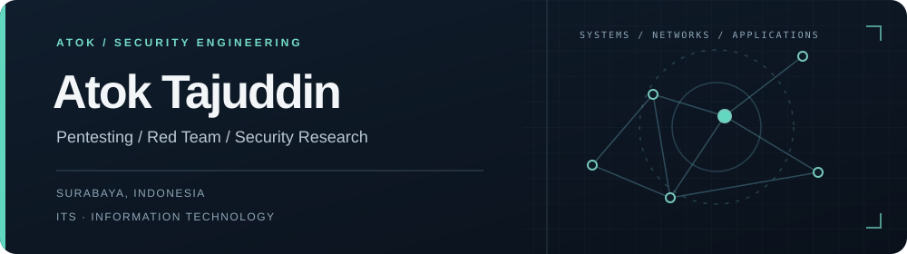

  

  
  
  

## About me

I am an Information Technology undergraduate at Institut Teknologi Sepuluh Nopember (ITS), based in Surabaya, Indonesia. I focus on offensive security and build practical tools to understand, test, and improve systems.

My interests include web and network security, penetration testing, red team methodologies, reverse engineering, and security automation.

## Selected projects

| Project | Focus |
| --- | --- |
| [BOAR Project](https://github.com/AtokTajuddin/BOAR_Project) | Buffer overflow analysis and remediation |
| [Nim PE Analyzer](https://github.com/AtokTajuddin/nim-pe-analyzer) | Detecting magic byte manipulation in Windows PE files |
| [SOC Architecture Project](https://github.com/AtokTajuddin/big_architectiure_soc_project) | SOC architecture, ML based detection, and CVE matching |

## Tools and technologies

- **Security:** Burp Suite, Nmap, Wireshark, Ghidra, Metasploit
- **Development:** Python, C/C++, Rust, Go, Bash, Linux, Docker, Git

## GitHub activity

  

<picture>
  <source media="(prefers-color-scheme: dark)" srcset="https://raw.githubusercontent.com/AtokTajuddin/AtokTajuddin/output/github-snake-dark.svg" />
  <source media="(prefers-color-scheme: light)" srcset="https://raw.githubusercontent.com/AtokTajuddin/AtokTajuddin/output/github-snake.svg" />
  
</picture>

---

Interested in collaborating on security research, CTFs, and open source security tooling.
